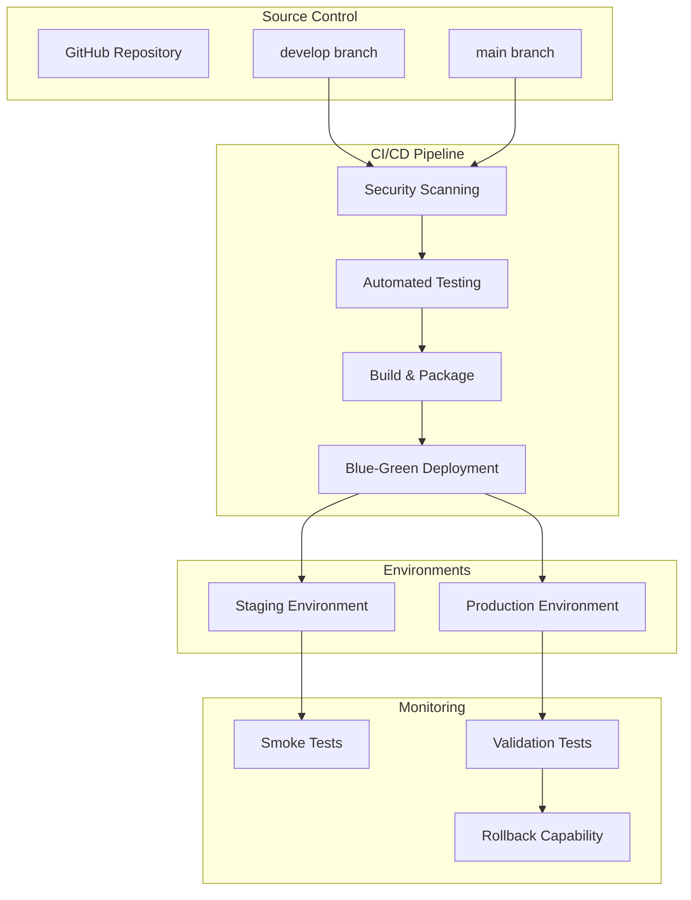

# AquaChain CI/CD Pipeline Documentation

## Overview

The AquaChain CI/CD pipeline provides automated testing, security scanning, and blue-green deployment capabilities for the water quality monitoring system. The pipeline supports both GitHub Actions and AWS CodeBuild for maximum flexibility.

## Architecture



## Pipeline Components

### 1. Security Scanning

**Tools Used:**
- Trivy: Vulnerability scanning for dependencies and containers
- Semgrep: Static analysis for security issues
- Custom security checks for AWS configurations

**Scan Types:**
- Dependency vulnerabilities
- Secret detection
- OWASP Top 10 security issues
- Infrastructure security misconfigurations

**Failure Criteria:**
- Critical vulnerabilities: Build fails
- High vulnerabilities: Warning (configurable)
- Secrets detected: Build fails

### 2. Automated Testing

#### Frontend Testing
- **Unit Tests**: React Testing Library + Jest
- **Integration Tests**: Component interaction testing
- **Accessibility Tests**: WCAG compliance validation
- **Coverage Requirement**: >80% code coverage

#### Lambda Function Testing
- **Unit Tests**: pytest with moto for AWS service mocking
- **Integration Tests**: End-to-end data flow validation
- **Performance Tests**: Cold start and execution time validation
- **Coverage Requirement**: >90% for business logic

#### Infrastructure Testing
- **Configuration Tests**: CloudFormation template validation
- **Security Tests**: IAM policy and resource configuration validation
- **Cost Optimization Tests**: Resource configuration validation

### 3. Build and Package

#### Lambda Functions
- Dependency installation and packaging
- Deployment package creation with optimized size
- Version tagging and artifact storage

#### Frontend Application
- React build optimization
- Static asset optimization
- Progressive Web App configuration

#### Infrastructure
- CloudFormation template validation
- CDK synthesis and validation
- Resource dependency verification

### 4. Blue-Green Deployment

#### Deployment Strategy
1. **GREEN Environment Creation**: Deploy new version to GREEN aliases/buckets
2. **Validation**: Comprehensive testing of GREEN environment
3. **Traffic Switch**: Atomic switch from BLUE to GREEN
4. **Post-Deployment Validation**: Production health checks
5. **BLUE Backup**: Update BLUE aliases for rollback capability

#### Rollback Capability
- Automatic rollback on validation failure
- Manual rollback script for emergency situations
- Health monitoring and alerting

## Configuration

### GitHub Actions Setup

#### Required Secrets
```yaml
# Staging Environment
AWS_ACCESS_KEY_ID_STAGING: <staging-access-key>
AWS_SECRET_ACCESS_KEY_STAGING: <staging-secret-key>
CLOUDFRONT_DISTRIBUTION_ID_STAGING: <staging-cloudfront-id>

# Production Environment
AWS_ACCESS_KEY_ID_PRODUCTION: <production-access-key>
AWS_SECRET_ACCESS_KEY_PRODUCTION: <production-secret-key>
CLOUDFRONT_DISTRIBUTION_ID_PRODUCTION: <production-cloudfront-id>

# Notifications
SLACK_WEBHOOK_URL: <slack-webhook-for-notifications>
```

#### Environment Variables
```yaml
AWS_REGION: us-east-1
NODE_VERSION: '18'
PYTHON_VERSION: '3.11'
```

### AWS CodeBuild Setup

#### Parameter Store Configuration
```bash
# API Base URLs
/aquachain/staging/api-base-url
/aquachain/production/api-base-url

# CloudFront Distribution IDs
/aquachain/staging/cloudfront-distribution-id
/aquachain/production/cloudfront-distribution-id
```

#### IAM Permissions
The CodeBuild service role requires permissions for:
- Lambda function deployment and management
- S3 bucket operations
- DynamoDB table access
- CloudFront invalidation
- Parameter Store access
- CloudWatch logging

## Usage

### Triggering Deployments

#### Automatic Triggers
- **Staging Deployment**: Push to `develop` branch
- **Production Deployment**: Push to `main` branch
- **Pull Request Validation**: PR to `main` branch

#### Manual Triggers
```bash
# GitHub Actions
gh workflow run ci-cd-pipeline.yml -f environment=staging

# AWS CodeBuild
aws codebuild start-build --project-name aquachain-ci-cd
```

### Manual Deployment

#### Using Deployment Script
```bash
# Deploy to staging
python scripts/deploy.py \
  --region us-east-1 \
  --environment staging \
  --package-path ./build-artifacts

# Deploy to production with validation only
python scripts/deploy.py \
  --region us-east-1 \
  --environment production \
  --package-path ./build-artifacts \
  --validate-only

# Full production deployment
python scripts/deploy.py \
  --region us-east-1 \
  --environment production \
  --package-path ./build-artifacts
```

### Emergency Rollback

#### Automatic Rollback
Rollback is automatically triggered when:
- GREEN environment validation fails
- Post-deployment validation fails
- Critical alerts are detected

#### Manual Rollback
```bash
# Emergency rollback
python scripts/rollback.py \
  --region us-east-1 \
  --environment production \
  --reason "Critical bug in latest deployment" \
  --confirm

# Check rollback status
python scripts/rollback.py \
  --region us-east-1 \
  --environment production \
  --status
```

## Monitoring and Alerting

### Pipeline Metrics
- Build success/failure rates
- Deployment frequency
- Lead time for changes
- Mean time to recovery (MTTR)

### System Health Monitoring
- Lambda function health and performance
- Frontend availability and performance
- Database connectivity and performance
- Alert delivery latency

### Alerting Channels
- Slack notifications for build status
- Email alerts for deployment events
- PagerDuty integration for critical issues
- CloudWatch alarms for system metrics

## Testing Strategy

### Test Pyramid

#### Unit Tests (70%)
- Individual function testing
- Mock external dependencies
- Fast execution (<1 second per test)
- High code coverage (>90%)

#### Integration Tests (20%)
- Component interaction testing
- Real AWS service integration (LocalStack)
- End-to-end data flow validation
- Moderate execution time (<30 seconds)

#### End-to-End Tests (10%)
- Full system workflow testing
- Production-like environment
- User journey validation
- Longer execution time (<5 minutes)

### Test Environments

#### LocalStack (CI/CD)
- AWS service emulation
- Fast test execution
- Consistent test environment
- No AWS costs

#### Staging Environment
- Production-like configuration
- Real AWS services
- Integration testing
- Performance validation

#### Production Environment
- Smoke tests only
- Non-destructive validation
- Health checks
- Performance monitoring

## Security Considerations

### Pipeline Security
- Encrypted secrets management
- Least privilege IAM roles
- Audit logging for all operations
- Secure artifact storage

### Deployment Security
- Code signing for Lambda packages
- Encrypted S3 buckets
- VPC endpoints for private communication
- WAF protection for APIs

### Compliance
- Audit trail for all deployments
- Immutable deployment artifacts
- Change approval workflows
- Compliance reporting

## Performance Optimization

### Build Performance
- Parallel test execution
- Cached dependencies
- Incremental builds
- Optimized Docker images

### Deployment Performance
- Blue-green deployment for zero downtime
- Parallel Lambda function updates
- CloudFront cache optimization
- Health check optimization

## Troubleshooting

### Common Issues

#### Build Failures
```bash
# Check build logs
aws codebuild batch-get-builds --ids <build-id>

# Review test results
aws s3 cp s3://aquachain-build-artifacts/test-results/ . --recursive
```

#### Deployment Failures
```bash
# Check deployment logs
aws logs get-log-events --log-group-name /aws/lambda/AquaChain-deploy

# Validate Lambda function status
aws lambda get-function --function-name AquaChain-data-processing-production
```

#### Rollback Issues
```bash
# Check rollback logs
python scripts/rollback.py --status --environment production

# Manual health check
python tests/smoke/production_validation_tests.py
```

### Debug Commands

#### Pipeline Status
```bash
# GitHub Actions
gh run list --workflow=ci-cd-pipeline.yml

# AWS CodeBuild
aws codebuild list-builds-for-project --project-name aquachain-ci-cd
```

#### System Health
```bash
# Lambda function health
aws lambda list-functions --function-version ALL

# S3 bucket status
aws s3 ls s3://aquachain-frontend-production-<account-id>/

# DynamoDB table status
aws dynamodb describe-table --table-name aquachain-readings-production
```

## Best Practices

### Development Workflow
1. Create feature branch from `develop`
2. Implement changes with tests
3. Create pull request to `develop`
4. Automated testing and review
5. Merge to `develop` for staging deployment
6. Create pull request from `develop` to `main`
7. Production deployment after approval

### Testing Best Practices
- Write tests before implementation (TDD)
- Maintain high test coverage (>90%)
- Use realistic test data
- Test error conditions and edge cases
- Regular test maintenance and updates

### Deployment Best Practices
- Small, frequent deployments
- Feature flags for gradual rollouts
- Comprehensive monitoring and alerting
- Quick rollback procedures
- Post-deployment validation

### Security Best Practices
- Regular security scanning
- Dependency updates
- Secrets rotation
- Access logging and monitoring
- Compliance validation

## Metrics and KPIs

### Deployment Metrics
- **Deployment Frequency**: Daily deployments to staging, weekly to production
- **Lead Time**: <2 hours from commit to production
- **Change Failure Rate**: <5% of deployments require rollback
- **Recovery Time**: <15 minutes for rollback completion

### Quality Metrics
- **Test Coverage**: >90% for Lambda functions, >80% for frontend
- **Build Success Rate**: >95% for all builds
- **Security Scan Pass Rate**: 100% (no critical vulnerabilities)
- **Performance Regression**: <5% degradation in key metrics

### System Metrics
- **Uptime**: >99.5% for production environment
- **Alert Latency**: <30 seconds for critical alerts
- **API Response Time**: <500ms for 95th percentile
- **Error Rate**: <1% for all system components

## Future Enhancements

### Planned Improvements
- Canary deployments for gradual traffic shifting
- Automated performance regression testing
- Advanced security scanning with SAST/DAST
- Multi-region deployment support
- Automated compliance reporting

### Integration Opportunities
- GitOps workflow with ArgoCD
- Advanced monitoring with Datadog/New Relic
- Chaos engineering with AWS Fault Injection Simulator
- Cost optimization with AWS Cost Explorer integration
- Advanced analytics with deployment insights