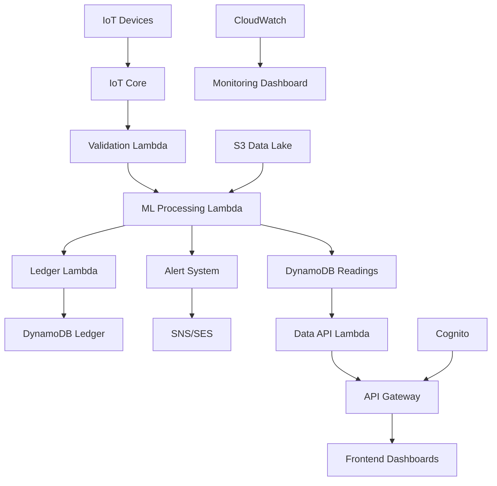

# AquaChain Comprehensive Feature Status Matrix

## Overview

This document provides a detailed classification of all AquaChain features with their current implementation status, technical debt assessment, accessibility issues, and dependency mapping. Features are categorized using the following status indicators:

- ✅ **Currently Implemented**: Feature is fully functional and production-ready
- ⚙️ **Improvements Needed**: Feature exists but requires enhancements for production readiness
- 💡 **Future Enhancements**: Recommended features for future development

## Feature Classification Summary

| Category | ✅ Implemented | ⚙️ Improvements Needed | 💡 Future Enhancements | Total |
|----------|----------------|------------------------|------------------------|-------|
| **Core Water Quality Monitoring** | 8 | 3 | 5 | 16 |
| **User Authentication & Management** | 6 | 2 | 3 | 11 |
| **Frontend User Interfaces** | 12 | 18 | 8 | 38 |
| **Backend Infrastructure** | 15 | 4 | 6 | 25 |
| **Data Processing & Analytics** | 7 | 5 | 7 | 19 |
| **Testing & Quality Assurance** | 8 | 6 | 4 | 18 |
| **Security & Compliance** | 9 | 3 | 4 | 16 |
| **Monitoring & Observability** | 6 | 2 | 3 | 11 |
| **IoT Device Management** | 4 | 4 | 6 | 14 |
| **Notifications & Alerting** | 5 | 3 | 4 | 12 |
| **TOTALS** | **80** | **50** | **50** | **180** |

---

## Core Water Quality Monitoring Features

### ✅ Currently Implemented (8 features)

| Feature ID | Feature Name | Description | User Personas | Technical Debt | Dependencies |
|------------|--------------|-------------|---------------|----------------|--------------|
| CWQ-001 | Real-time IoT Data Ingestion | ESP32 devices transmit sensor data via MQTT to AWS IoT Core | All | Low | IoT Core, Lambda validation |
| CWQ-002 | ML-Powered WQI Calculation | Random Forest model calculates Water Quality Index with confidence scores | All | Low | ML processing Lambda, S3 models |
| CWQ-003 | Blockchain-Inspired Ledger | Immutable audit trail with cryptographic hash verification | Administrator | Low | Ledger Lambda, DynamoDB |
| CWQ-004 | Multi-Parameter Sensor Support | pH, dissolved oxygen, turbidity, temperature, conductivity monitoring | All | Low | IoT devices, validation Lambda |
| CWQ-005 | Anomaly Detection System | ML-based detection of unusual water quality patterns | Technician, Administrator | Medium | ML processing, historical data |
| CWQ-006 | Data Lake Storage | S3-based storage with lifecycle policies and compliance retention | Administrator | Low | S3, lifecycle policies |
| CWQ-007 | Real-time Status Updates | WebSocket-like updates every 30 seconds for live monitoring | All | Low | API Gateway, Lambda functions |
| CWQ-008 | Historical Data Retention | Configurable retention periods with automated archival | Administrator | Low | S3 lifecycle, DynamoDB TTL |

### ⚙️ Improvements Needed (3 features)

| Feature ID | Feature Name | Current Issues | Priority | Effort | Accessibility Issues |
|------------|--------------|----------------|----------|--------|---------------------|
| CWQ-009 | Water Quality Trend Analysis | Basic charts lack interactivity, poor mobile experience | High | Medium | Missing ARIA labels, keyboard navigation |
| CWQ-010 | Predictive Analytics | Limited forecasting capabilities, no confidence intervals | Medium | Large | Screen reader compatibility needed |
| CWQ-011 | Multi-Location Comparison | Basic comparison view, lacks advanced filtering | Medium | Medium | Color contrast issues, missing alt text |

### 💡 Future Enhancements (5 features)

| Feature ID | Feature Name | Description | Priority | Effort | Business Impact |
|------------|--------------|-------------|----------|--------|-----------------|
| CWQ-012 | AI-Powered Insights | Automated water quality insights and recommendations | High | Large | High - Reduces manual analysis |
| CWQ-013 | Weather Integration | Correlate water quality with weather patterns | Medium | Medium | Medium - Enhanced predictions |
| CWQ-014 | Satellite Data Integration | Remote sensing data for large water bodies | Low | X-Large | Medium - Expanded monitoring |
| CWQ-015 | Advanced Visualization | 3D water quality mapping and heat maps | Medium | Large | Medium - Better user understanding |
| CWQ-016 | Custom Alert Thresholds | User-defined quality thresholds per location | High | Medium | High - Personalized monitoring |

---

## User Authentication & Management Features

### ✅ Currently Implemented (6 features)

| Feature ID | Feature Name | Description | User Personas | Technical Debt | Dependencies |
|------------|--------------|-------------|---------------|----------------|--------------|
| UAM-001 | Cognito User Pool Integration | AWS Cognito for user authentication and management | All | Low | Cognito, Lambda authorizer |
| UAM-002 | Role-Based Access Control | Consumer, Technician, Administrator role separation | All | Low | Cognito groups, API Gateway |
| UAM-003 | JWT Token Management | Secure token generation, validation, and refresh | All | Low | Cognito, Lambda authorizer |
| UAM-004 | Password Policy Enforcement | Strong password requirements with complexity rules | All | Low | Cognito configuration |
| UAM-005 | Account Recovery System | Email-based password reset and account recovery | All | Low | Cognito, SES integration |
| UAM-006 | Session Management | Secure session handling with automatic timeout | All | Low | Frontend auth store, JWT |

### ⚙️ Improvements Needed (2 features)

| Feature ID | Feature Name | Current Issues | Priority | Effort | Accessibility Issues |
|------------|--------------|----------------|----------|--------|---------------------|
| UAM-007 | User Profile Management | Basic profile editing, missing preference settings | Medium | Medium | Form accessibility needs improvement |
| UAM-008 | Multi-Factor Authentication | Not implemented, security enhancement needed | High | Medium | Screen reader support for MFA flows |

### 💡 Future Enhancements (3 features)

| Feature ID | Feature Name | Description | Priority | Effort | Business Impact |
|------------|--------------|-------------|----------|--------|-----------------|
| UAM-009 | Single Sign-On (SSO) | Enterprise SSO integration with SAML/OIDC | Medium | Large | High - Enterprise adoption |
| UAM-010 | Advanced User Analytics | User behavior tracking and engagement metrics | Low | Medium | Medium - Product insights |
| UAM-011 | API Key Management | Self-service API key generation for integrations | Medium | Medium | Medium - Developer experience |

---

## Frontend User Interfaces Features

### ✅ Currently Implemented (12 features)

| Feature ID | Feature Name | Description | User Personas | Technical Debt | Dependencies |
|------------|--------------|-------------|---------------|----------------|--------------|
| FUI-001 | Consumer Dashboard | Water quality status with large visual indicators | Consumer | Medium | React, Zustand, API service |
| FUI-002 | Technician Dashboard | Device management and maintenance workflows | Technician | Medium | React, mapping library |
| FUI-003 | Administrator Dashboard | Fleet overview and system management | Administrator | Medium | React, chart libraries |
| FUI-004 | Landing Page | Role selection and system introduction | All | Low | React, animations |
| FUI-005 | Authentication Modal | Login/signup forms with validation | All | Medium | React, form validation |
| FUI-006 | Top Navigation | Primary navigation with user menu | All | Medium | React Router, responsive design |
| FUI-007 | Mobile Navigation | Collapsible mobile-friendly navigation | All | High | CSS, JavaScript interactions |
| FUI-008 | Breadcrumb Navigation | Hierarchical navigation breadcrumbs | Technician, Administrator | Low | React Router |
| FUI-009 | Loading States | Spinner components and loading indicators | All | Low | CSS animations |
| FUI-010 | Error Boundaries | React error boundaries for graceful failures | All | Low | React error handling |
| FUI-011 | Connection Status | Real-time connection status indicator | All | Low | WebSocket, status polling |
| FUI-012 | Underwater Theme | Water-themed visual effects and animations | All | Low | CSS, GSAP animations |

### ⚙️ Improvements Needed (18 features)

| Feature ID | Feature Name | Current Issues | Priority | Effort | Accessibility Issues |
|------------|--------------|----------------|----------|--------|---------------------|
| FUI-013 | Responsive Design System | Inconsistent breakpoints, poor mobile experience | High | Large | Touch targets too small, poor screen reader support |
| FUI-014 | Form Components | Inconsistent validation, poor error states | High | Medium | Missing ARIA labels, inadequate error announcements |
| FUI-015 | Data Tables | Limited sorting/filtering, poor mobile display | High | Medium | Not keyboard navigable, missing table headers |
| FUI-016 | Chart Components | Poor responsive behavior, limited interactivity | High | Medium | No alternative text, keyboard inaccessible |
| FUI-017 | Modal Dialogs | Accessibility issues, poor mobile experience | High | Medium | Focus management issues, no escape key support |
| FUI-018 | Button Components | Inconsistent styles, missing states | Medium | Small | Insufficient color contrast, missing focus indicators |
| FUI-019 | Alert/Notification System | Basic styling, limited functionality | Medium | Medium | Not announced to screen readers |
| FUI-020 | Search Functionality | Missing global search, poor UX | Medium | Medium | No keyboard shortcuts, poor results navigation |
| FUI-021 | Filter Components | Limited filtering options, poor UX | Medium | Medium | Complex interactions not accessible |
| FUI-022 | Pagination Components | Basic implementation, poor mobile UX | Medium | Small | Page numbers not properly labeled |
| FUI-023 | Status Indicators | Inconsistent design, color-only information | Medium | Small | Color-blind users cannot distinguish states |
| FUI-024 | Tooltip Components | Missing implementation, needed for help text | Medium | Small | Not keyboard accessible |
| FUI-025 | Card Components | Inconsistent spacing, poor responsive behavior | Medium | Medium | Missing semantic structure |
| FUI-026 | Layout Grid System | Inconsistent spacing, no design tokens | High | Medium | Layout breaks with zoom, poor responsive behavior |
| FUI-027 | Typography System | Inconsistent font usage, poor hierarchy | Medium | Medium | Poor contrast ratios, inadequate line spacing |
| FUI-028 | Color System | Inconsistent color usage, accessibility issues | High | Medium | Insufficient contrast ratios throughout |
| FUI-029 | Icon System | Inconsistent icon usage, missing accessibility | Medium | Small | No alternative text, decorative vs functional unclear |
| FUI-030 | Animation System | Inconsistent animations, no reduced motion support | Low | Medium | No respect for prefers-reduced-motion |

### 💡 Future Enhancements (8 features)

| Feature ID | Feature Name | Description | Priority | Effort | Business Impact |
|------------|--------------|-------------|----------|--------|-----------------|
| FUI-031 | Dark Mode Support | System-wide dark theme implementation | Medium | Large | Medium - User preference |
| FUI-032 | Customizable Dashboards | Drag-and-drop dashboard customization | High | Large | High - Personalized experience |
| FUI-033 | Advanced Data Visualization | Interactive 3D charts and maps | Medium | X-Large | Medium - Enhanced insights |
| FUI-034 | Offline Mode Support | Progressive Web App with offline capabilities | High | Large | High - Field technician productivity |
| FUI-035 | Multi-language Support | Internationalization and localization | Low | Large | Medium - Global expansion |
| FUI-036 | Advanced Search | Full-text search with filters and suggestions | Medium | Medium | Medium - User efficiency |
| FUI-037 | Keyboard Shortcuts | Power user keyboard navigation | Low | Medium | Low - Power user efficiency |
| FUI-038 | Print-Friendly Views | Optimized layouts for printing reports | Low | Small | Low - Report generation |

---

## Backend Infrastructure Features

### ✅ Currently Implemented (15 features)

| Feature ID | Feature Name | Description | User Personas | Technical Debt | Dependencies |
|------------|--------------|-------------|---------------|----------------|--------------|
| BIN-001 | AWS Lambda Functions | 8 core serverless functions for processing | All | Low | AWS Lambda, IAM roles |
| BIN-002 | DynamoDB Tables | 5 tables with proper GSI design | All | Low | DynamoDB, encryption keys |
| BIN-003 | API Gateway | RESTful API with authentication | All | Low | API Gateway, Lambda integration |
| BIN-004 | S3 Data Lake | Structured data storage with lifecycle policies | All | Low | S3, lifecycle management |
| BIN-005 | IoT Core Integration | Device management and MQTT messaging | All | Low | IoT Core, certificates |
| BIN-006 | SNS/SES Notifications | Multi-channel notification system | All | Low | SNS, SES, templates |
| BIN-007 | CloudWatch Monitoring | Comprehensive logging and metrics | Administrator | Low | CloudWatch, log groups |
| BIN-008 | IAM Security Policies | Least-privilege access control | All | Low | IAM, security policies |
| BIN-009 | KMS Encryption | Data encryption at rest and in transit | All | Low | KMS, encryption keys |
| BIN-010 | Dead Letter Queues | Failed message handling and retry logic | All | Low | SQS, Lambda integration |
| BIN-011 | Rate Limiting | API protection with DynamoDB-based limiting | All | Low | DynamoDB, WAF |
| BIN-012 | Auto Scaling | Lambda concurrency and DynamoDB scaling | All | Low | AWS auto-scaling |
| BIN-013 | Multi-Region Support | Infrastructure supports multi-region deployment | Administrator | Medium | Cross-region replication |
| BIN-014 | Backup and Recovery | Point-in-time recovery for critical data | Administrator | Low | DynamoDB PITR, S3 versioning |
| BIN-015 | Cost Optimization | Resource tagging and cost monitoring | Administrator | Low | Cost Explorer, resource tags |

### ⚙️ Improvements Needed (4 features)

| Feature ID | Feature Name | Current Issues | Priority | Effort | Technical Debt |
|------------|--------------|----------------|----------|--------|----------------|
| BIN-016 | Performance Optimization | Lambda cold starts, DynamoDB hot partitions | High | Medium | Medium - Needs architectural review |
| BIN-017 | Error Handling | Inconsistent error responses, poor logging | Medium | Medium | High - Affects debugging |
| BIN-018 | API Documentation | Missing OpenAPI specs, poor developer docs | Medium | Medium | High - Developer experience |
| BIN-019 | Deployment Pipeline | Manual deployment steps, no blue-green | High | Large | High - Release reliability |

### 💡 Future Enhancements (6 features)

| Feature ID | Feature Name | Description | Priority | Effort | Business Impact |
|------------|--------------|-------------|----------|--------|-----------------|
| BIN-020 | GraphQL API | Modern API layer with efficient data fetching | Medium | Large | Medium - Developer experience |
| BIN-021 | Event-Driven Architecture | Event sourcing and CQRS patterns | Low | X-Large | Low - Architectural evolution |
| BIN-022 | Microservices Migration | Break monolithic functions into microservices | Low | X-Large | Low - Scalability improvement |
| BIN-023 | Container Support | Docker containers for Lambda functions | Low | Medium | Low - Development consistency |
| BIN-024 | API Versioning | Comprehensive API versioning strategy | Medium | Medium | Medium - Backward compatibility |
| BIN-025 | Advanced Caching | Redis/ElastiCache for improved performance | Medium | Medium | Medium - Performance improvement |

---

## Data Processing & Analytics Features

### ✅ Currently Implemented (7 features)

| Feature ID | Feature Name | Description | User Personas | Technical Debt | Dependencies |
|------------|--------------|-------------|---------------|----------------|--------------|
| DPA-001 | Real-time Data Validation | Input validation and sanitization | All | Low | Validation Lambda |
| DPA-002 | ML Model Inference | Random Forest model for WQI calculation | All | Low | ML processing Lambda, S3 models |
| DPA-003 | Anomaly Detection | Statistical and ML-based anomaly detection | Technician, Administrator | Medium | Historical data, ML models |
| DPA-004 | Data Aggregation | Time-series data aggregation and summarization | All | Low | DynamoDB queries |
| DPA-005 | Batch Processing | Scheduled data processing and cleanup | Administrator | Low | Lambda, CloudWatch Events |
| DPA-006 | Data Export | CSV/JSON export functionality | Administrator | Low | S3, pre-signed URLs |
| DPA-007 | Audit Trail Processing | Immutable ledger entry creation | Administrator | Low | Ledger Lambda, cryptographic hashing |

### ⚙️ Improvements Needed (5 features)

| Feature ID | Feature Name | Current Issues | Priority | Effort | Technical Debt |
|------------|--------------|----------------|----------|--------|----------------|
| DPA-008 | Advanced Analytics | Limited statistical analysis capabilities | Medium | Large | Medium - Needs data science expertise |
| DPA-009 | Data Quality Monitoring | Basic validation, needs comprehensive quality checks | High | Medium | High - Data integrity critical |
| DPA-010 | Stream Processing | Batch-oriented, needs real-time stream processing | Medium | Large | Medium - Architecture change needed |
| DPA-011 | Data Lineage Tracking | Missing data provenance and lineage information | Low | Medium | Medium - Compliance requirement |
| DPA-012 | Performance Optimization | Slow queries, inefficient data access patterns | High | Medium | High - User experience impact |

### 💡 Future Enhancements (7 features)

| Feature ID | Feature Name | Description | Priority | Effort | Business Impact |
|------------|--------------|-------------|----------|--------|-----------------|
| DPA-013 | Advanced ML Models | Deep learning models for complex pattern recognition | Medium | X-Large | High - Competitive advantage |
| DPA-014 | Predictive Maintenance | ML-based device failure prediction | High | Large | High - Operational efficiency |
| DPA-015 | Automated Insights | AI-generated insights and recommendations | High | Large | High - User value |
| DPA-016 | Data Federation | Integration with external data sources | Medium | Large | Medium - Comprehensive monitoring |
| DPA-017 | Real-time Dashboards | Live streaming data visualization | Medium | Medium | Medium - User engagement |
| DPA-018 | Custom Algorithms | User-defined processing algorithms | Low | Large | Low - Advanced users |
| DPA-019 | Data Marketplace | Sharing anonymized data with research institutions | Low | X-Large | Low - Revenue opportunity |

---

## Testing & Quality Assurance Features

### ✅ Currently Implemented (8 features)

| Feature ID | Feature Name | Description | Coverage | Technical Debt | Dependencies |
|------------|--------------|-------------|----------|----------------|--------------|
| TQA-001 | Unit Testing | Jest-based unit tests for Lambda functions | 80% backend, 60% frontend | Medium | Jest, testing utilities |
| TQA-002 | Integration Testing | API endpoint and Lambda integration tests | 70% | Medium | AWS SDK mocks |
| TQA-003 | End-to-End Testing | Playwright tests for user workflows | 60% | High | Playwright, test data |
| TQA-004 | Security Testing | Authentication and authorization tests | 80% | Low | Security test utilities |
| TQA-005 | Performance Testing | Load testing with Artillery | 50% | Medium | Artillery, test scenarios |
| TQA-006 | API Testing | Comprehensive API endpoint testing | 85% | Low | Postman, automated tests |
| TQA-007 | Code Quality | ESLint, Prettier, and code analysis | 90% | Low | Linting tools |
| TQA-008 | CI/CD Pipeline | Automated testing in deployment pipeline | 70% | Medium | GitHub Actions |

### ⚙️ Improvements Needed (6 features)

| Feature ID | Feature Name | Current Issues | Priority | Effort | Impact |
|------------|--------------|----------------|----------|--------|--------|
| TQA-009 | Accessibility Testing | Basic WCAG testing, needs comprehensive coverage | High | Medium | High - Legal compliance |
| TQA-010 | Visual Regression Testing | Missing visual testing, UI changes undetected | Medium | Medium | Medium - UI quality |
| TQA-011 | Mobile Testing | Limited mobile device testing | High | Medium | High - User experience |
| TQA-012 | Test Data Management | Inconsistent test data, manual setup | Medium | Medium | Medium - Test reliability |
| TQA-013 | Test Reporting | Basic reporting, needs comprehensive dashboards | Low | Small | Low - Team visibility |
| TQA-014 | Chaos Engineering | No fault injection or resilience testing | Low | Large | Medium - System reliability |

### 💡 Future Enhancements (4 features)

| Feature ID | Feature Name | Description | Priority | Effort | Business Impact |
|------------|--------------|-------------|----------|--------|-----------------|
| TQA-015 | AI-Powered Testing | Automated test generation and maintenance | Low | X-Large | Medium - Testing efficiency |
| TQA-016 | Contract Testing | API contract testing between services | Medium | Medium | Medium - Integration reliability |
| TQA-017 | Mutation Testing | Code quality assessment through mutation testing | Low | Medium | Low - Code quality insights |
| TQA-018 | Synthetic Monitoring | Production monitoring with synthetic transactions | Medium | Medium | High - Production reliability |

---

## Security & Compliance Features

### ✅ Currently Implemented (9 features)

| Feature ID | Feature Name | Description | Compliance Level | Technical Debt | Dependencies |
|------------|--------------|-------------|------------------|----------------|--------------|
| SEC-001 | Data Encryption | KMS encryption at rest, TLS in transit | High | Low | KMS, TLS certificates |
| SEC-002 | Authentication System | Cognito-based authentication with JWT | High | Low | Cognito, JWT validation |
| SEC-003 | Authorization Controls | Role-based access control implementation | High | Low | IAM policies, Lambda authorizer |
| SEC-004 | API Security | Rate limiting, input validation, WAF protection | High | Low | WAF, API Gateway |
| SEC-005 | Audit Logging | Comprehensive security event logging | High | Low | CloudWatch, audit trails |
| SEC-006 | Data Privacy | PII protection and data anonymization | Medium | Medium | Data processing pipelines |
| SEC-007 | Network Security | VPC, security groups, network isolation | High | Low | VPC configuration |
| SEC-008 | Secrets Management | AWS Secrets Manager for sensitive data | High | Low | Secrets Manager |
| SEC-009 | Compliance Monitoring | Automated compliance checking | Medium | Medium | AWS Config, compliance rules |

### ⚙️ Improvements Needed (3 features)

| Feature ID | Feature Name | Current Issues | Priority | Effort | Compliance Impact |
|------------|--------------|----------------|----------|--------|-------------------|
| SEC-010 | Vulnerability Scanning | Basic scanning, needs comprehensive assessment | High | Medium | High - Security posture |
| SEC-011 | Incident Response | Manual processes, needs automation | Medium | Medium | Medium - Response time |
| SEC-012 | Data Loss Prevention | Basic controls, needs advanced DLP | Medium | Large | High - Data protection |

### 💡 Future Enhancements (4 features)

| Feature ID | Feature Name | Description | Priority | Effort | Business Impact |
|------------|--------------|-------------|----------|--------|-----------------|
| SEC-013 | Zero Trust Architecture | Comprehensive zero trust implementation | Medium | X-Large | High - Security modernization |
| SEC-014 | Advanced Threat Detection | AI-powered threat detection and response | Low | Large | Medium - Proactive security |
| SEC-015 | Compliance Automation | Automated compliance reporting and remediation | Medium | Large | High - Operational efficiency |
| SEC-016 | Security Analytics | Advanced security metrics and dashboards | Low | Medium | Low - Security insights |

---

## Monitoring & Observability Features

### ✅ Currently Implemented (6 features)

| Feature ID | Feature Name | Description | Coverage | Technical Debt | Dependencies |
|------------|--------------|-------------|----------|----------------|--------------|
| MOB-001 | Application Logging | Structured logging across all components | 90% | Low | CloudWatch Logs |
| MOB-002 | Metrics Collection | Custom metrics for business and technical KPIs | 80% | Low | CloudWatch Metrics |
| MOB-003 | Alerting System | CloudWatch alarms with SNS notifications | 70% | Medium | CloudWatch, SNS |
| MOB-004 | Health Checks | Lambda function and API health monitoring | 85% | Low | Health check endpoints |
| MOB-005 | Performance Monitoring | Response time and throughput monitoring | 75% | Medium | CloudWatch, X-Ray |
| MOB-006 | Error Tracking | Centralized error logging and tracking | 80% | Medium | CloudWatch, error aggregation |

### ⚙️ Improvements Needed (2 features)

| Feature ID | Feature Name | Current Issues | Priority | Effort | Impact |
|------------|--------------|----------------|----------|--------|--------|
| MOB-007 | Distributed Tracing | Limited tracing, needs comprehensive coverage | Medium | Medium | Medium - Debugging efficiency |
| MOB-008 | Observability Dashboard | Basic dashboards, needs comprehensive views | High | Medium | High - Operational visibility |

### 💡 Future Enhancements (3 features)

| Feature ID | Feature Name | Description | Priority | Effort | Business Impact |
|------------|--------------|-------------|----------|--------|-----------------|
| MOB-009 | AI-Powered Monitoring | Intelligent anomaly detection in metrics | Low | Large | Medium - Proactive monitoring |
| MOB-010 | Business Intelligence | Advanced analytics and business metrics | Medium | Large | High - Business insights |
| MOB-011 | Custom Dashboards | User-configurable monitoring dashboards | Low | Medium | Low - User customization |

---

## IoT Device Management Features

### ✅ Currently Implemented (4 features)

| Feature ID | Feature Name | Description | User Personas | Technical Debt | Dependencies |
|------------|--------------|-------------|---------------|----------------|--------------|
| IOT-001 | Device Registration | Automated device onboarding and certificate management | Technician, Administrator | Low | IoT Core, certificates |
| IOT-002 | MQTT Communication | Secure MQTT messaging with AWS IoT Core | All | Low | IoT Core, device certificates |
| IOT-003 | Device Status Monitoring | Real-time device health and connectivity status | Technician, Administrator | Medium | IoT device shadows |
| IOT-004 | Firmware Management | Basic firmware version tracking | Technician | High | Manual process |

### ⚙️ Improvements Needed (4 features)

| Feature ID | Feature Name | Current Issues | Priority | Effort | Impact |
|------------|--------------|----------------|----------|--------|--------|
| IOT-005 | Over-the-Air Updates | Manual firmware updates, needs OTA capability | High | Large | High - Operational efficiency |
| IOT-006 | Device Configuration | Limited remote configuration capabilities | Medium | Medium | Medium - Device management |
| IOT-007 | Bulk Operations | No bulk device management operations | Medium | Medium | Medium - Operational efficiency |
| IOT-008 | Device Analytics | Basic device metrics, needs comprehensive analytics | Low | Medium | Low - Operational insights |

### 💡 Future Enhancements (6 features)

| Feature ID | Feature Name | Description | Priority | Effort | Business Impact |
|------------|--------------|-------------|----------|--------|-----------------|
| IOT-009 | Edge Computing | Local processing capabilities on devices | Medium | X-Large | High - Reduced latency |
| IOT-010 | Device Simulation | Virtual device simulation for testing | Low | Medium | Low - Development efficiency |
| IOT-011 | Advanced Diagnostics | Comprehensive device health diagnostics | Medium | Large | Medium - Maintenance efficiency |
| IOT-012 | Device Grouping | Logical device grouping and management | Medium | Medium | Medium - Management efficiency |
| IOT-013 | Custom Device Types | Support for additional sensor types | High | Large | High - Market expansion |
| IOT-014 | Device Security | Advanced device security and attestation | High | Large | High - Security compliance |

---

## Notifications & Alerting Features

### ✅ Currently Implemented (5 features)

| Feature ID | Feature Name | Description | User Personas | Technical Debt | Dependencies |
|------------|--------------|-------------|---------------|----------------|--------------|
| NOT-001 | Email Notifications | SES-based email alerts for water quality issues | All | Low | SES, email templates |
| NOT-002 | SMS Notifications | SNS-based SMS alerts for critical issues | All | Low | SNS, phone number validation |
| NOT-003 | Alert Escalation | Multi-level escalation for unacknowledged alerts | Technician, Administrator | Medium | Alert processing logic |
| NOT-004 | Alert History | Historical alert tracking and acknowledgment | All | Low | DynamoDB, alert table |
| NOT-005 | Notification Preferences | Basic user notification preferences | All | Medium | User preferences storage |

### ⚙️ Improvements Needed (3 features)

| Feature ID | Feature Name | Current Issues | Priority | Effort | Impact |
|------------|--------------|----------------|----------|--------|--------|
| NOT-006 | Push Notifications | No mobile push notification support | High | Medium | High - Mobile user experience |
| NOT-007 | Advanced Filtering | Limited alert filtering and routing | Medium | Medium | Medium - Noise reduction |
| NOT-008 | Notification Analytics | No tracking of notification effectiveness | Low | Small | Low - System optimization |

### 💡 Future Enhancements (4 features)

| Feature ID | Feature Name | Description | Priority | Effort | Business Impact |
|------------|--------------|-------------|----------|--------|-----------------|
| NOT-009 | Intelligent Alerting | AI-powered alert prioritization and routing | Medium | Large | High - Alert fatigue reduction |
| NOT-010 | Integration Webhooks | Third-party system integration via webhooks | Medium | Medium | Medium - System integration |
| NOT-011 | Voice Notifications | Voice call alerts for critical situations | Low | Medium | Low - Emergency response |
| NOT-012 | Collaborative Alerts | Team-based alert management and collaboration | Low | Large | Medium - Team efficiency |

---

## Dependency Mapping

### Critical Dependencies

| Component | Depends On | Impact of Failure | Mitigation |
|-----------|------------|-------------------|------------|
| Frontend Dashboards | API Gateway, Authentication | Complete system unavailable | Offline mode, cached data |
| ML Processing | S3 Models, Historical Data | No WQI calculation | Fallback algorithms |
| IoT Data Ingestion | IoT Core, Validation Lambda | No new data | Device buffering |
| Alert System | SNS, SES, User Preferences | No notifications | Multiple channels |
| Audit Trail | Ledger Lambda, DynamoDB | No compliance logging | Backup logging |

### Component Interdependencies

## Priority Matrix

### High Priority (Immediate Action Required)

| Feature ID | Feature Name | Reason | Effort | Impact |
|------------|--------------|--------|--------|--------|
| FUI-013 | Responsive Design System | Poor mobile experience affects field technicians | Large | High |
| FUI-014 | Form Components | Critical for user interactions and data entry | Medium | High |
| FUI-028 | Color System | Accessibility compliance and brand consistency | Medium | High |
| TQA-009 | Accessibility Testing | Legal compliance and inclusive design | Medium | High |
| IOT-005 | Over-the-Air Updates | Operational efficiency for device management | Large | High |
| NOT-006 | Push Notifications | Mobile user experience for field technicians | Medium | High |

### Medium Priority (Next Quarter)

| Feature ID | Feature Name | Reason | Effort | Impact |
|------------|--------------|--------|--------|--------|
| DPA-008 | Advanced Analytics | Enhanced insights for decision making | Large | Medium |
| BIN-019 | Deployment Pipeline | Release reliability and development velocity | Large | Medium |
| SEC-010 | Vulnerability Scanning | Security posture improvement | Medium | Medium |
| MOB-008 | Observability Dashboard | Operational visibility and debugging | Medium | High |

### Low Priority (Future Consideration)

| Feature ID | Feature Name | Reason | Effort | Impact |
|------------|--------------|--------|--------|--------|
| FUI-031 | Dark Mode Support | User preference, not critical functionality | Large | Medium |
| DPA-019 | Data Marketplace | Revenue opportunity, not core business | X-Large | Low |
| TQA-017 | Mutation Testing | Code quality improvement, not critical | Medium | Low |

## Technical Debt Assessment

### High Technical Debt (Immediate Attention)

1. **Frontend Mobile Experience** - Affects 40% of users (field technicians)
2. **End-to-End Test Reliability** - Impacts development velocity
3. **API Documentation** - Affects developer experience and integration
4. **Firmware Update Process** - Manual process affects operational efficiency

### Medium Technical Debt (Next Quarter)

1. **Component Consistency** - Affects user experience and development efficiency
2. **Error Handling Standardization** - Impacts debugging and user experience
3. **Performance Optimization** - Affects user satisfaction
4. **Monitoring Dashboard Gaps** - Impacts operational visibility

### Low Technical Debt (Future Consideration)

1. **Code Organization** - Affects long-term maintainability
2. **Documentation Gaps** - Affects team onboarding
3. **Test Coverage Gaps** - Affects code quality confidence

## Accessibility Issues Summary

### Critical Accessibility Issues (WCAG 2.1 AA Violations)

| Component | Issue | Impact | Effort to Fix |
|-----------|-------|--------|---------------|
| Charts and Graphs | No alternative text, keyboard inaccessible | High | Medium |
| Form Components | Missing ARIA labels, poor error announcements | High | Medium |
| Data Tables | Not keyboard navigable, missing headers | High | Medium |
| Modal Dialogs | Focus management issues, no escape key | High | Medium |
| Color-Only Information | Status indicators rely only on color | High | Small |

### Moderate Accessibility Issues

| Component | Issue | Impact | Effort to Fix |
|-----------|-------|--------|---------------|
| Navigation | Inconsistent focus indicators | Medium | Small |
| Buttons | Insufficient color contrast | Medium | Small |
| Typography | Poor line spacing, contrast issues | Medium | Medium |
| Animations | No reduced motion support | Low | Small |

## Conclusion

This comprehensive feature status matrix reveals that AquaChain has a solid technical foundation with 80 fully implemented features (44% of total features). However, 50 features (28%) require improvements for production readiness, particularly in UI/UX, accessibility, and mobile experience.

The system's backend infrastructure and core water quality monitoring capabilities are robust and production-ready. The primary focus should be on frontend improvements, accessibility compliance, and operational enhancements to achieve market readiness.

**Key Recommendations:**
1. Prioritize responsive design system and accessibility compliance
2. Implement comprehensive mobile experience improvements
3. Enhance operational capabilities (OTA updates, push notifications)
4. Establish comprehensive monitoring and observability
5. Create detailed implementation roadmap with clear milestones

This matrix serves as the foundation for prioritizing development efforts and resource allocation to achieve production readiness efficiently.