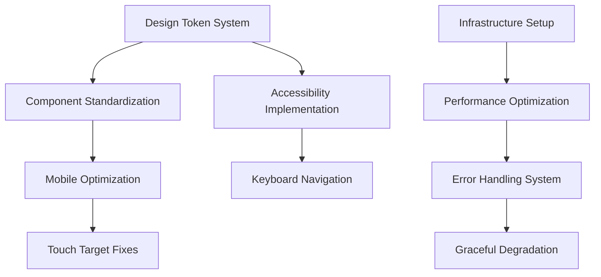

# AquaChain Implementation Roadmap and Prioritization

## Executive Summary

This document provides a comprehensive implementation roadmap for AquaChain's transformation from its current intermediate state to a production-ready, accessible, and user-friendly water quality monitoring system. The roadmap prioritizes improvements by user impact, technical complexity, and resource requirements, organized into strategic implementation phases with clear milestones and success criteria.

## Current State Assessment

### System Maturity Overview
- **Total Features Analyzed**: 180 features across 10 categories
- **Currently Implemented**: 80 features (44%)
- **Improvements Needed**: 50 features (28%)
- **Future Enhancements**: 50 features (28%)

### Critical Issues Requiring Immediate Attention
1. **Accessibility Compliance**: Multiple WCAG 2.1 AA violations
2. **Mobile Experience**: Poor touch targets and responsive design
3. **UI Consistency**: Inconsistent design system implementation
4. **Performance Optimization**: Lambda cold starts and inefficient queries
5. **Error Handling**: Generic error messages without recovery guidance

---

## Implementation Strategy Framework

### Prioritization Matrix

**Impact Levels:**
- 🔥 **Critical**: Addresses legal compliance, security, or major usability barriers
- ⚡ **High**: Significantly improves user efficiency or satisfaction
- 📈 **Medium**: Noticeable improvement in user experience
- 🔧 **Low**: Nice-to-have improvements for power users

**Complexity Assessment:**
- 🟢 **Simple**: 1-3 weeks, minimal dependencies, single developer
- 🟡 **Medium**: 4-8 weeks, moderate complexity, 2-3 developers
- 🔴 **Complex**: 9+ weeks, significant architectural changes, full team

**Resource Requirements:**
- **Frontend Developer**: UI/UX improvements, component development
- **Backend Developer**: API optimization, infrastructure improvements
- **Full-Stack Developer**: End-to-end feature implementation
- **DevOps Engineer**: Deployment, monitoring, performance optimization
- **UX Designer**: Design system, accessibility, user research

---

## Phase 1: Foundation and Compliance (Weeks 1-8)
*Priority: Critical Issues and Legal Compliance*

### 1.1 Accessibility Compliance Implementation (Weeks 1-4)
**Objective**: Achieve WCAG 2.1 AA compliance across all interfaces

#### Critical Tasks:
| Task | Priority | Complexity | Effort | Resources | Dependencies |
|------|----------|------------|--------|-----------|--------------|
| Fix color contrast violations | 🔥 Critical | 🟢 Simple | 2 weeks | Frontend Dev | Design tokens |
| Implement skip links and landmarks | 🔥 Critical | 🟢 Simple | 1 week | Frontend Dev | None |
| Add proper ARIA labels and descriptions | 🔥 Critical | 🟡 Medium | 2 weeks | Frontend Dev | Content audit |
| Implement keyboard navigation | 🔥 Critical | 🟡 Medium | 3 weeks | Frontend Dev | Component refactor |
| Screen reader compatibility | 🔥 Critical | 🟡 Medium | 2 weeks | Frontend Dev | Testing tools |

**Success Criteria:**
- 100% WCAG 2.1 AA compliance validation
- Zero critical accessibility violations
- Keyboard navigation success rate: 100%
- Screen reader compatibility score: 95%+

**Dependencies:**
- Design token system implementation
- Component library standardization
- Accessibility testing tools setup

### 1.2 Mobile Experience Optimization (Weeks 3-6)
**Objective**: Transform mobile experience from poor to excellent

#### Critical Tasks:
| Task | Priority | Complexity | Effort | Resources | Dependencies |
|------|----------|------------|--------|-----------|--------------|
| Fix touch target sizes (44px minimum) | 🔥 Critical | 🟢 Simple | 1 week | Frontend Dev | Design system |
| Implement responsive navigation | 🔥 Critical | 🟡 Medium | 2 weeks | Frontend Dev | Navigation refactor |
| Optimize mobile forms and inputs | ⚡ High | 🟡 Medium | 2 weeks | Frontend Dev | Form components |
| Add gesture support | ⚡ High | 🟡 Medium | 2 weeks | Frontend Dev | Touch libraries |
| Mobile performance optimization | ⚡ High | 🟡 Medium | 1 week | Frontend Dev | Bundle analysis |

**Success Criteria:**
- Touch target compliance: 100% (minimum 44px)
- Mobile task completion rate: 90%+
- Mobile page load time: <3 seconds
- Mobile bounce rate reduction: 25%

### 1.3 Design System Foundation (Weeks 5-8)
**Objective**: Establish consistent design system across all components

#### Critical Tasks:
| Task | Priority | Complexity | Effort | Resources | Dependencies |
|------|----------|------------|--------|-----------|--------------|
| Implement design token system | ⚡ High | 🟡 Medium | 2 weeks | Frontend Dev + Designer | Color audit |
| Standardize component library | ⚡ High | 🔴 Complex | 4 weeks | Frontend Dev | Component audit |
| Create responsive grid system | ⚡ High | 🟡 Medium | 1 week | Frontend Dev | Layout analysis |
| Implement consistent typography | 📈 Medium | 🟢 Simple | 1 week | Frontend Dev | Font selection |
| Standardize spacing and sizing | 📈 Medium | 🟢 Simple | 1 week | Frontend Dev | Design tokens |

**Success Criteria:**
- 90% reduction in design inconsistencies
- 50% faster component implementation time
- Unified design system documentation
- Developer satisfaction score: 4.5/5

---

## Phase 2: User Experience Enhancement (Weeks 9-16)
*Priority: High-Impact User Experience Improvements*

### 2.1 Navigation and Information Architecture (Weeks 9-12)
**Objective**: Improve navigation efficiency and user orientation

#### High-Impact Tasks:
| Task | Priority | Complexity | Effort | Resources | Dependencies |
|------|----------|------------|--------|-----------|--------------|
| Smart breadcrumb navigation | ⚡ High | 🟡 Medium | 2 weeks | Frontend Dev | Navigation system |
| Context-aware quick actions | ⚡ High | 🟡 Medium | 3 weeks | Full-Stack Dev | User analytics |
| Progressive navigation disclosure | ⚡ High | 🟡 Medium | 2 weeks | Frontend Dev | Usage patterns |
| Keyboard shortcuts system | 📈 Medium | 🟡 Medium | 2 weeks | Frontend Dev | Action mapping |
| Search functionality enhancement | 📈 Medium | 🔴 Complex | 3 weeks | Full-Stack Dev | Search service |

**Success Criteria:**
- Navigation efficiency improvement: 40%
- User task completion time reduction: 30%
- Navigation confusion reduction: 60%
- User satisfaction score: 4.2/5

### 2.2 Feedback and Status Communication (Weeks 11-14)
**Objective**: Implement intelligent feedback and status systems

#### High-Impact Tasks:
| Task | Priority | Complexity | Effort | Resources | Dependencies |
|------|----------|------------|--------|-----------|--------------|
| Multi-modal status indicators | 🔥 Critical | 🟡 Medium | 2 weeks | Frontend Dev | Status system |
| Proactive guidance system | ⚡ High | 🔴 Complex | 4 weeks | Full-Stack Dev | User behavior analysis |
| Real-time progress indicators | ⚡ High | 🟡 Medium | 2 weeks | Frontend Dev | Operation tracking |
| Intelligent error recovery | 🔥 Critical | 🔴 Complex | 3 weeks | Full-Stack Dev | Error analysis |
| Notification system enhancement | 📈 Medium | 🟡 Medium | 2 weeks | Full-Stack Dev | Notification service |

**Success Criteria:**
- User error rate reduction: 50%
- Support request reduction: 35%
- User confidence improvement: 40%
- Error recovery success rate: 80%

### 2.3 Performance and Reliability (Weeks 13-16)
**Objective**: Optimize system performance and reliability

#### High-Impact Tasks:
| Task | Priority | Complexity | Effort | Resources | Dependencies |
|------|----------|------------|--------|-----------|--------------|
| Lambda cold start optimization | ⚡ High | 🟡 Medium | 2 weeks | Backend Dev | Infrastructure |
| DynamoDB query optimization | ⚡ High | 🟡 Medium | 2 weeks | Backend Dev | Data access patterns |
| Frontend bundle optimization | ⚡ High | 🟢 Simple | 1 week | Frontend Dev | Build tools |
| Caching strategy implementation | 📈 Medium | 🟡 Medium | 2 weeks | Backend Dev | Cache service |
| Graceful degradation system | ⚡ High | 🔴 Complex | 3 weeks | Full-Stack Dev | Feature detection |

**Success Criteria:**
- Page load time improvement: 40%
- API response time: <200ms average
- System uptime: 99.9%
- User-perceived performance score: 4.0/5

---

## Phase 3: Advanced Features and Quality of Life (Weeks 17-24)
*Priority: Medium-Impact Enhancements and User Delight*

### 3.1 Personalization and Adaptive Interface (Weeks 17-20)
**Objective**: Implement user-centric personalization features

#### Medium-Impact Tasks:
| Task | Priority | Complexity | Effort | Resources | Dependencies |
|------|----------|------------|--------|-----------|--------------|
| Adaptive interface personalization | 📈 Medium | 🔴 Complex | 4 weeks | Full-Stack Dev | User analytics |
| Customizable dashboard layouts | 📈 Medium | 🔴 Complex | 3 weeks | Frontend Dev | Drag-drop library |
| User preference management | 📈 Medium | 🟡 Medium | 2 weeks | Full-Stack Dev | Settings service |
| Theme customization system | 🔧 Low | 🟡 Medium | 2 weeks | Frontend Dev | Design tokens |
| Workspace personalization | 🔧 Low | 🟡 Medium | 2 weeks | Frontend Dev | Layout system |

**Success Criteria:**
- User engagement increase: 25%
- Feature adoption rate: 70%
- Personalization usage: 60% of users
- User satisfaction improvement: 15%

### 3.2 Advanced Data Visualization (Weeks 19-22)
**Objective**: Enhance data presentation and insights

#### Medium-Impact Tasks:
| Task | Priority | Complexity | Effort | Resources | Dependencies |
|------|----------|------------|--------|-----------|--------------|
| Interactive chart components | 📈 Medium | 🔴 Complex | 3 weeks | Frontend Dev | Chart library |
| Real-time data streaming | 📈 Medium | 🔴 Complex | 4 weeks | Full-Stack Dev | WebSocket service |
| Advanced filtering and sorting | 📈 Medium | 🟡 Medium | 2 weeks | Frontend Dev | Data processing |
| Export and reporting features | 📈 Medium | 🟡 Medium | 2 weeks | Full-Stack Dev | Report generation |
| Data comparison tools | 🔧 Low | 🟡 Medium | 2 weeks | Frontend Dev | Comparison logic |

**Success Criteria:**
- Data interaction engagement: 50% increase
- Report generation usage: 40% of users
- Data insight discovery: 30% improvement
- User productivity increase: 20%

### 3.3 Quality of Life Enhancements (Weeks 21-24)
**Objective**: Implement user delight and efficiency features

#### Medium-Impact Tasks:
| Task | Priority | Complexity | Effort | Resources | Dependencies |
|------|----------|------------|--------|-----------|--------------|
| Bulk operations interface | 📈 Medium | 🟡 Medium | 2 weeks | Frontend Dev | Selection system |
| Advanced search with filters | 📈 Medium | 🟡 Medium | 3 weeks | Full-Stack Dev | Search service |
| Offline mode support | 🔧 Low | 🔴 Complex | 4 weeks | Full-Stack Dev | Service worker |
| Keyboard shortcuts expansion | 🔧 Low | 🟡 Medium | 1 week | Frontend Dev | Shortcut system |
| Context-sensitive help system | 📈 Medium | 🟡 Medium | 2 weeks | Frontend Dev | Help content |

**Success Criteria:**
- Power user efficiency: 35% improvement
- Feature discoverability: 50% increase
- User onboarding time: 40% reduction
- Advanced feature adoption: 30%

---

## Phase 4: Future Enhancements and Innovation (Weeks 25-32)
*Priority: Low-Impact but High-Value Future Features*

### 4.1 Advanced Analytics and AI Features (Weeks 25-28)
**Objective**: Implement intelligent features for competitive advantage

#### Future Enhancement Tasks:
| Task | Priority | Complexity | Effort | Resources | Dependencies |
|------|----------|------------|--------|-----------|--------------|
| AI-powered insights generation | 🔧 Low | 🔴 Complex | 4 weeks | ML Engineer + Backend Dev | ML pipeline |
| Predictive maintenance alerts | 📈 Medium | 🔴 Complex | 3 weeks | ML Engineer + Backend Dev | Historical data |
| Automated anomaly detection | 📈 Medium | 🔴 Complex | 3 weeks | ML Engineer + Backend Dev | ML models |
| Natural language query interface | 🔧 Low | 🔴 Complex | 4 weeks | Full-Stack Dev | NLP service |
| Advanced pattern recognition | 🔧 Low | 🔴 Complex | 3 weeks | ML Engineer | Pattern analysis |

### 4.2 Integration and Extensibility (Weeks 27-30)
**Objective**: Enable third-party integrations and extensibility

#### Future Enhancement Tasks:
| Task | Priority | Complexity | Effort | Resources | Dependencies |
|------|----------|------------|--------|-----------|--------------|
| API versioning and documentation | 📈 Medium | 🟡 Medium | 2 weeks | Backend Dev | API gateway |
| Webhook system implementation | 📈 Medium | 🟡 Medium | 2 weeks | Backend Dev | Event system |
| Third-party integration framework | 🔧 Low | 🔴 Complex | 3 weeks | Backend Dev | Integration patterns |
| Plugin architecture | 🔧 Low | 🔴 Complex | 4 weeks | Full-Stack Dev | Plugin system |
| Custom dashboard widgets | 🔧 Low | 🔴 Complex | 3 weeks | Frontend Dev | Widget framework |

### 4.3 Advanced Security and Compliance (Weeks 29-32)
**Objective**: Implement enterprise-grade security features

#### Future Enhancement Tasks:
| Task | Priority | Complexity | Effort | Resources | Dependencies |
|------|----------|------------|--------|-----------|--------------|
| Advanced audit logging | 📈 Medium | 🟡 Medium | 2 weeks | Backend Dev | Logging service |
| Compliance reporting automation | 📈 Medium | 🟡 Medium | 2 weeks | Backend Dev | Compliance rules |
| Advanced threat detection | 🔧 Low | 🔴 Complex | 3 weeks | Security Engineer | Security tools |
| Zero-trust architecture | 🔧 Low | 🔴 Complex | 4 weeks | DevOps + Security | Infrastructure |
| Data loss prevention | 📈 Medium | 🔴 Complex | 3 weeks | Security Engineer | DLP tools |

---

## Dependency Mapping and Critical Path Analysis

### Critical Dependencies

#### Phase 1 Dependencies:

#### Cross-Phase Dependencies:
1. **Design System Foundation** (Phase 1) → **All UI Improvements** (Phases 2-4)
2. **Performance Optimization** (Phase 2) → **Advanced Features** (Phases 3-4)
3. **User Analytics** (Phase 2) → **Personalization** (Phase 3)
4. **API Standardization** (Phase 2) → **Integrations** (Phase 4)

### Critical Path Analysis

**Longest Critical Path**: 32 weeks
1. Design Token System (2 weeks)
2. Component Standardization (4 weeks)
3. Accessibility Implementation (4 weeks)
4. Mobile Optimization (4 weeks)
5. Performance Optimization (4 weeks)
6. Advanced Features (8 weeks)
7. Future Enhancements (6 weeks)

**Parallel Execution Opportunities**:
- Accessibility and Mobile work can run in parallel after design system
- Backend performance optimization can run parallel to frontend improvements
- Documentation and testing can run parallel to feature development

---

## Resource Allocation and Timeline Estimates

### Team Composition Recommendations

#### Core Team (Phases 1-2):
- **2 Frontend Developers**: UI/UX improvements, component development
- **1 Backend Developer**: API optimization, performance improvements
- **1 Full-Stack Developer**: End-to-end features, integration work
- **1 DevOps Engineer**: Infrastructure, deployment, monitoring
- **1 UX Designer**: Design system, accessibility, user research
- **1 QA Engineer**: Testing, validation, quality assurance

#### Extended Team (Phases 3-4):
- **1 ML Engineer**: AI features, predictive analytics
- **1 Security Engineer**: Advanced security features
- **1 Technical Writer**: Documentation, help systems

### Budget Estimates

#### Phase 1 (8 weeks): $240,000
- Critical accessibility and mobile improvements
- Design system foundation
- Core team of 6 people

#### Phase 2 (8 weeks): $280,000
- User experience enhancements
- Performance optimization
- Core team + additional specialists

#### Phase 3 (8 weeks): $320,000
- Advanced features and personalization
- Extended team with specialized skills

#### Phase 4 (8 weeks): $360,000
- Future enhancements and innovation
- Full extended team with ML and security specialists

**Total Project Budget**: $1,200,000 over 32 weeks

### Risk Mitigation Strategies

#### High-Risk Areas:
1. **Accessibility Compliance**: Legal and regulatory risks
   - **Mitigation**: Early accessibility audit, expert consultation
   - **Contingency**: 2-week buffer for compliance fixes

2. **Performance Optimization**: Technical complexity risks
   - **Mitigation**: Performance baseline establishment, incremental improvements
   - **Contingency**: Fallback to simpler optimization strategies

3. **User Adoption**: Feature adoption risks
   - **Mitigation**: User research, iterative feedback, gradual rollout
   - **Contingency**: Feature rollback capabilities

#### Medium-Risk Areas:
1. **Resource Availability**: Team scaling risks
   - **Mitigation**: Early recruitment, contractor relationships
   - **Contingency**: Scope reduction for non-critical features

2. **Technical Dependencies**: Third-party service risks
   - **Mitigation**: Vendor evaluation, backup options
   - **Contingency**: In-house development alternatives

---

## Success Metrics and KPIs

### Phase 1 Success Metrics:
- **Accessibility**: 100% WCAG 2.1 AA compliance
- **Mobile Experience**: 90% mobile task completion rate
- **Design Consistency**: 90% reduction in design inconsistencies
- **Performance**: 40% improvement in page load times

### Phase 2 Success Metrics:
- **User Efficiency**: 40% improvement in navigation efficiency
- **Error Reduction**: 50% reduction in user errors
- **Support Reduction**: 35% reduction in support requests
- **User Satisfaction**: 4.2/5 user satisfaction score

### Phase 3 Success Metrics:
- **Feature Adoption**: 70% adoption rate for new features
- **User Engagement**: 25% increase in user engagement
- **Productivity**: 20% increase in user productivity
- **Personalization**: 60% of users using personalization features

### Phase 4 Success Metrics:
- **Innovation Adoption**: 30% adoption of advanced features
- **Integration Usage**: 40% of enterprise users using integrations
- **Competitive Advantage**: Market differentiation metrics
- **Future Readiness**: Technical debt reduction to <10%

### Overall Project Success Criteria:
- **User Experience**: 4.5/5 overall user satisfaction
- **Accessibility**: 100% legal compliance
- **Performance**: <3 second page load times
- **Reliability**: 99.9% system uptime
- **Adoption**: 90% feature utilization rate
- **Business Impact**: 40% increase in user retention

---

## Implementation Guidelines and Best Practices

### Development Methodology:
- **Agile/Scrum**: 2-week sprints with regular retrospectives
- **Test-Driven Development**: Comprehensive testing for all features
- **Continuous Integration**: Automated testing and deployment
- **User-Centered Design**: Regular user feedback and testing

### Quality Assurance:
- **Accessibility Testing**: Automated and manual testing for every release
- **Performance Testing**: Load testing and performance monitoring
- **Cross-Browser Testing**: Compatibility across all major browsers
- **Mobile Testing**: Device testing across iOS and Android

### Documentation Requirements:
- **Technical Documentation**: API documentation, architecture guides
- **User Documentation**: Help systems, user guides, tutorials
- **Design Documentation**: Design system, component library
- **Process Documentation**: Development workflows, deployment guides

### Change Management:
- **Stakeholder Communication**: Regular updates and demos
- **User Training**: Training materials and sessions
- **Gradual Rollout**: Feature flags and phased deployment
- **Feedback Collection**: User feedback systems and analysis

This comprehensive implementation roadmap provides a clear path from AquaChain's current state to a world-class water quality monitoring system that meets modern standards for accessibility, usability, and performance while delivering significant business value and competitive advantage.