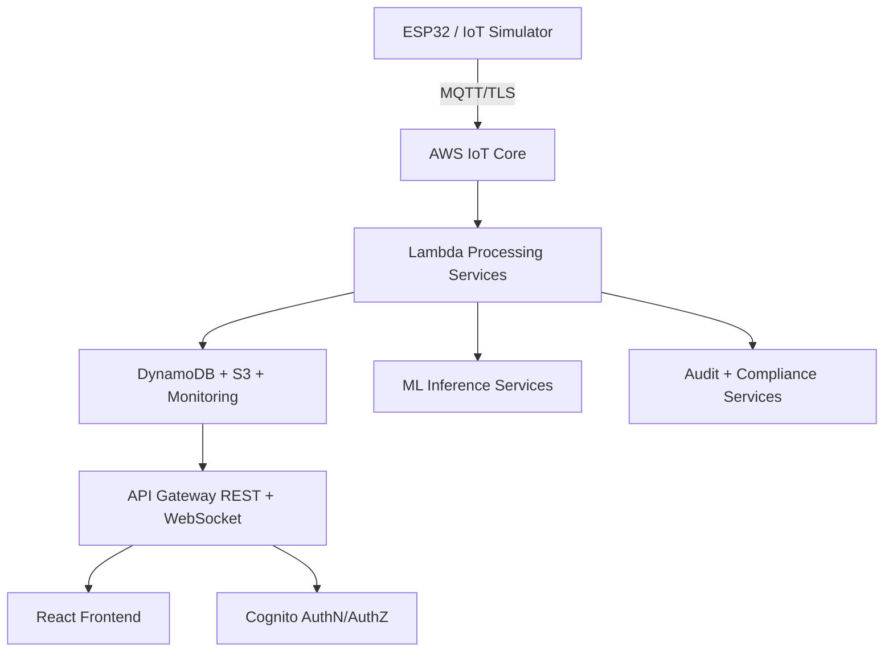

# AquaChain

<p align="center">
  
</p>

<p align="center">
  
</p>

[]()
[]()
[-f59e0b)]()
[-7c3aed)]()
[]()

AquaChain is a production-focused IoT platform for monitoring water quality, running cloud-side analytics, and managing operations across multiple user roles.

## Project Snapshot

Derived from the current repository:

- 54 Lambda service directories in [`lambda/`](lambda/)
- 781 Python files across backend/infrastructure/simulator code
- 290 TypeScript/TSX files in [`frontend/src/`](frontend/src/)
- 380 tests (Python + frontend unit/integration tests)
- 39 CDK stack files in [`infrastructure/cdk/stacks/`](infrastructure/cdk/stacks/)
- 500+ markdown documentation files under [`DOCS/`](DOCS/)

## Core Capabilities

- Real-time sensor ingestion for pH, turbidity, TDS, and temperature.
- Role-based application areas:
  - Consumer: device status, readings, alerts, order tracking.
  - Technician: task assignment, service operations, maintenance flow.
  - Admin: system configuration, audits, compliance, analytics.
- Security and governance workflows:
  - Cognito auth + RBAC.
  - Audit trails and security monitoring services.
  - GDPR-related consent/export/deletion service modules.
- Extended operations:
  - Order management, payment integration, and shipment tracking.
  - Notification and websocket services.
  - ML inference and model lifecycle utilities.

## Architecture (Code-Aligned)



Primary infrastructure orchestration lives in [`infrastructure/cdk/stacks/api_stack.py`](infrastructure/cdk/stacks/api_stack.py) and related stack files.

## Technology Stack

### Frontend

- React 19 + TypeScript
- Framer Motion animations
- Recharts visualization
- AWS Amplify client libraries
- Storybook + a11y/performance/security test scripts

### Backend

- AWS Lambda (Python-focused service modules)
- API Gateway (REST and WebSocket)
- Cognito (user pool, identity pool, group-based access)
- DynamoDB + S3 persistence layers
- Monitoring and alerting modules

### Infrastructure + Ops

- AWS CDK (Python)
- GitHub workflows in [`.github/workflows/`](.github/workflows/)
- Cost optimization and setup scripts in [`scripts/`](scripts/)

### IoT + ML

- ESP32 firmware and simulator support in [`iot-simulator/`](iot-simulator/)
- ML inference/training modules in [`lambda/ml_inference/`](lambda/ml_inference/) and [`lambda/ml_training/`](lambda/ml_training/)

## Quick Start (Local)

### 1) Clone

```bash
git clone <your-repo-url>
cd AquaChain-Final
```

### 2) Setup

Windows:

```powershell
scripts\setup\setup-local.bat
scripts\setup\start-local.bat
```

Linux/macOS:

```bash
chmod +x scripts/setup/setup-local.sh scripts/setup/start-local.sh
./scripts/setup/setup-local.sh
./scripts/setup/start-local.sh
```

### 3) Frontend manual start (alternative)

```bash
cd frontend
npm install
npm start
```

## Infrastructure Deployment (AWS CDK)

```bash
cd infrastructure/cdk
cdk bootstrap aws://<ACCOUNT_ID>/<REGION>
cdk deploy --all
```

After deployment, update frontend environment/config values from CDK outputs.

## Testing

### Frontend

```bash
cd frontend
npm test
npm run test:ci
npm run test:security
npm run test:a11y
```

### Backend + Integration

```bash
pytest
pytest tests/integration -v
```

## Repository Structure

```text
AquaChain-Final/
|-- frontend/                  React app, UI modules, tests, service clients
|-- lambda/                    Serverless service modules by domain
|-- infrastructure/cdk/        CDK stacks and deployment orchestration
|-- iot-simulator/             Device simulator + ESP32 firmware assets
|-- tests/                     Cross-service and infra test suites
|-- scripts/                   Setup, maintenance, deployment, security helpers
`-- DOCS/                      Project reports, guides, architecture docs
```

## Documentation Map

- Primary report: [`DOCS/reports/PROJECT_REPORT.md`](DOCS/reports/PROJECT_REPORT.md)
- Guides index: [`DOCS/guides/GUIDES_INDEX.md`](DOCS/guides/GUIDES_INDEX.md)
- Documentation navigation: [`DOCS/guides/NAVIGATION_GUIDE.md`](DOCS/guides/NAVIGATION_GUIDE.md)
- Project status report: [`DOCS/reports/PROJECT_STATUS_REPORT.md`](DOCS/reports/PROJECT_STATUS_REPORT.md)
- Security policy: [`SECURITY.md`](SECURITY.md)

## Security Notes

- Never commit secrets or real credentials.
- Use environment files from templates (for example [`.env.example`](.env.example)).
- Keep API keys restricted and rotated.
- Run secret scanning checks before pushing changes.

## Product Animation Notes

The frontend already includes animation support and motion-driven components via `framer-motion`. Major UI surfaces are under:

- [`frontend/src/components/LandingPage/`](frontend/src/components/LandingPage/)
- [`frontend/src/components/Dashboard/`](frontend/src/components/Dashboard/)
- [`frontend/src/styles/animations.css`](frontend/src/styles/animations.css)

## License

MIT License. See [`LICENSE`](LICENSE) if present in the repository root.
